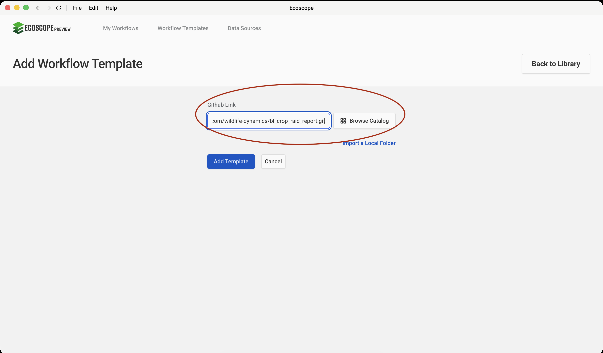
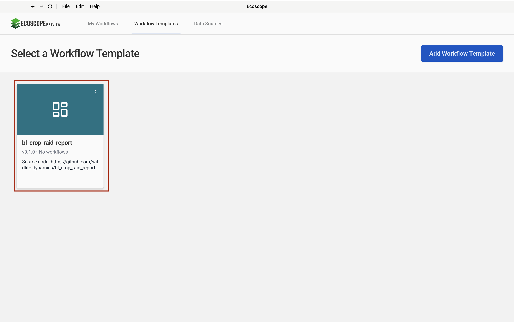
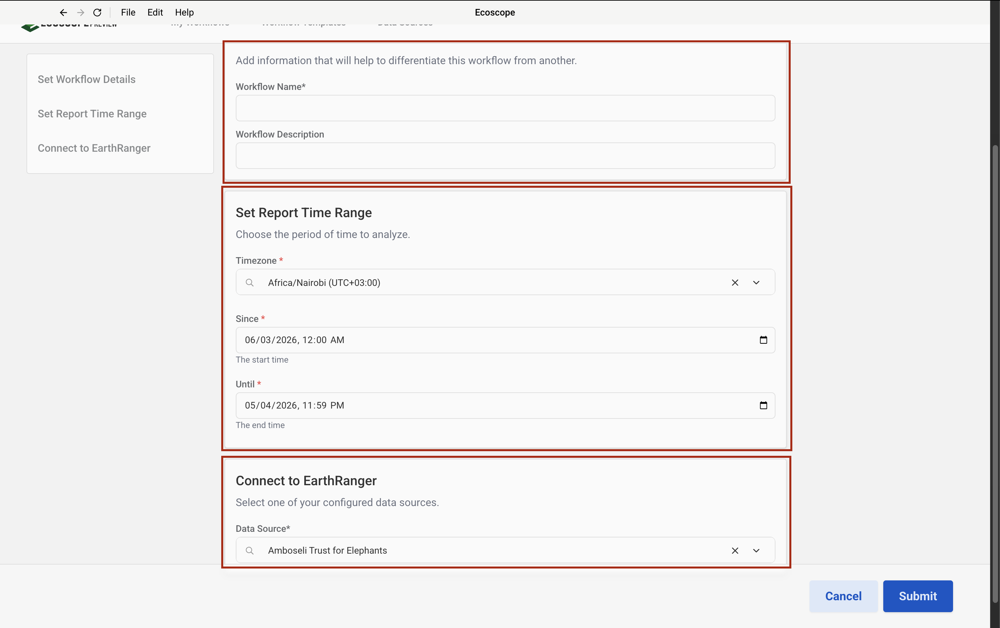

# BL Crop Raid Report — User Guide

This guide walks you through configuring and running the Big Life Crop Raid Report workflow, which ingests human-wildlife conflict crop raid events from EarthRanger and produces a comprehensive incident analysis report for the Amboseli ecosystem.

---

## Overview

The workflow delivers, for each run:

- **Charts** — time-of-day incident distribution, damage size boxplot by ranger response timing, monthly incidents by crop raid location, crop species pie charts (by count and by area), monthly incidents and damage stacked bars
- **Maps** — crop raid density grid, timing of ranger response scatter map, species responsible scatter map, per-month crop destroyed scatter maps
- **Summary tables** — elephant damage by month, mean elephant group size, ranger response timing with percentages, total acres damaged, species damage, crop damage (6 GeoParquet files)
- A **Word document report** — all charts, maps, and tables assembled into the Big Life crop raid report template

---

## Prerequisites

Before running the workflow, ensure you have:

- Access to an **EarthRanger** instance with `hwc_crop_raids` events logged for the analysis period

---

## Step-by-Step Configuration

### Step 1 — Add the Workflow Template

In the workflow runner, go to **Workflow Templates** and click **Add Workflow Template**. Paste the GitHub repository URL into the **Github Link** field:

```
https://github.com/wildlife-dynamics/bl_crop_raid_report.git
```

Then click **Add Template**.



---

### Step 2 — Add an EarthRanger Connection

Navigate to **Data Sources** and click **Connect**. Select **EarthRanger** from the data source type dialog, then fill in the connection form:

- **Data Source Name** — a label to identify this connection
- **EarthRanger URL** — your instance URL (e.g. `your-site.pamdas.org`)
- **EarthRanger Username** and **EarthRanger Password**

> Credentials are not validated at setup time. Any authentication errors will appear when the workflow runs.

Click **Connect** to save.


---

### Step 3 — Select the Workflow

After the template is added, it appears in the **Workflow Templates** list as **bl_crop_raid_report**. Click it to open the workflow configuration form.

> The card may show **Initializing…** briefly while the environment is set up.



---

### Step 4 — Set Workflow Details, Report Time Range, and Connect to EarthRanger

The configuration form has three sections.

**Set Workflow Details**

| Field | Description |
|-------|-------------|
| Workflow Name | A short name to identify this run |
| Workflow Description | Optional notes (e.g. month, site, or reporting period) |

**Set Report Time Range**

| Field | Description |
|-------|-------------|
| Timezone | Select the local timezone (e.g. `Africa/Nairobi UTC+03:00`) |
| Since | Start date and time of the analysis period |
| Until | End date and time of the analysis period |

All crop raid events are fetched within this window. Monthly breakdowns in the charts and maps are derived from the event timestamps within this range.

**Connect to EarthRanger**

Select the EarthRanger data source configured in Step 2 from the **Data Source** dropdown (e.g. `Amboseli Trust for Elephants`).



---

## Running the Workflow

Once all parameters are configured, click **Submit**. The runner will:

1. Download the Amboseli land-use, ranch boundary, and electric fence layers from Dropbox.
2. Fetch `hwc_crop_raids` events from EarthRanger for the specified time range.
3. Process and normalise event details (field titles, numeric conversions, time bins).
4. Generate all 7 charts and persist as HTML and PNG.
5. Generate the density grid map, response timing map, species map, and per-month crop maps.
6. Compute 6 summary tables and persist as GeoParquet files.
7. Look up the current EarthRanger user's name for report attribution.
8. Populate the Big Life crop raid Word template with all outputs.
9. Save all files to the directory specified by `ECOSCOPE_WORKFLOWS_RESULTS`.

---

## Output Files

All outputs are written to `$ECOSCOPE_WORKFLOWS_RESULTS/`:

| File | Description |
|------|-------------|
| `time_bin_bar_chart.html` / `.png` | Time of day bar chart (3-hour bins) |
| `damage_size_boxplot.html` / `.png` | Damage size boxplot by ranger response timing |
| `monthly_crop_raid_location_incidents.html` / `.png` | Monthly incidents stacked by crop raid location |
| `proportion_crop_species_targeted.html` / `.png` | Crop species pie chart by incident count (Core AOO) |
| `proportion_land_damaged.html` / `.png` | Crop species pie chart by total acres damaged (Core AOO) |
| `total_incidents_recorded.html` / `.png` | Monthly incidents stacked by grouped crop (Core AOO) |
| `total_damage_recorded.html` / `.png` | Monthly damage in acres stacked by grouped crop (Core AOO) |
| `crop_raid_incident_density_map.html` / `.png` | Density grid map of all crop raid incidents |
| `timing_of_response_event_map.html` / `.png` | Scatter map coloured by ranger response timing |
| `species_responsible_event_map.html` / `.png` | Scatter map coloured by species responsible |
| `<month>.html` / `.png` | Per-month crop destroyed scatter map |
| `total_land_size_damaged_by_elephants.geoparquet` | Elephant damage by month and crop species (acres) |
| `average_elephant_group_size_over_time.geoparquet` | Mean elephant group size per month |
| `timing_of_ranger_response.geoparquet` | Ranger response timing crosstab with percentages |
| `total_area_damaged_by_crop_raid_location.geoparquet` | Acres damaged by response timing and location |
| `total_land_damage_by_species_responsible.geoparquet` | Species incidents and acres by crop raid location |
| `total_crops_damaged_by_species.geoparquet` | Crop incidents and acres by crop raid location |
| `big_life_crop_raid_report.docx` | Final populated Word crop raid report |
